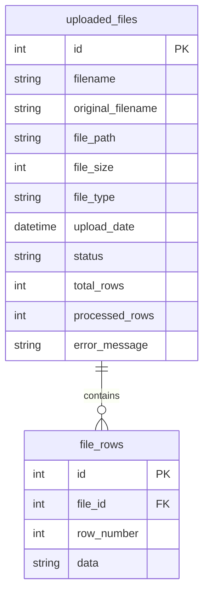

# File Parser CRUD API

A FastAPI application for uploading and parsing CSV/Excel files with SQLite database storage.

## Features
- Upload CSV and Excel files via REST API
- Automatic file parsing and storage in SQLite database
- List all uploaded files with pagination
- Get file details and parsing progress
- View parsed data with pagination
- Delete files and associated data
- Background processing for file parsing

## Requirements
- Python 3.8+
- All dependencies listed in `requirements.txt`

## Installation & Setup
```bash
# Install dependencies
pip install -r requirements.txt

# Start the server
uvicorn file_parser_crud.main:app --reload --host 0.0.0.0 --port 8000
```

## API Endpoints
- **POST /files** - Upload file
- **GET /files** - List files
- **GET /files/{id}** - Get file details
- **GET /files/{id}/rows** - Get parsed rows
- **GET /files/{id}/progress** - Check progress
- **DELETE /files/{id}** - Delete file
- **GET /health** - Health check

## Database Schema

### uploaded_files Table
```sql
CREATE TABLE uploaded_files (
    id INTEGER PRIMARY KEY AUTOINCREMENT,
    filename VARCHAR(255) NOT NULL,
    original_filename VARCHAR(255) NOT NULL,
    file_path VARCHAR(500) NOT NULL,
    file_size INTEGER NOT NULL,
    file_type VARCHAR(50) NOT NULL,
    upload_date DATETIME DEFAULT CURRENT_TIMESTAMP,
    status VARCHAR(20) DEFAULT 'pending',
    total_rows INTEGER DEFAULT 0,
    processed_rows INTEGER DEFAULT 0,
    error_message TEXT
);
```

### file_rows Table
```sql
CREATE TABLE file_rows (
    id INTEGER PRIMARY KEY AUTOINCREMENT,
    file_id INTEGER NOT NULL,
    row_number INTEGER NOT NULL,
    data TEXT NOT NULL,
    FOREIGN KEY (file_id) REFERENCES uploaded_files(id)
);
```

### Database Schema Diagram


## Screenshots & Documentation


### API Documentation
- **Swagger UI**: `http://localhost:8000/docs`
- **ReDoc**: `http://localhost:8000/redoc`

### Sample Usage
```bash
# Upload a file
curl -X POST "http://localhost:8000/files" \
  -H "Content-Type: multipart/form-data" \
  -F "file=@sample_data.csv"

# List files
curl "http://localhost:8000/files"

# Get file details
curl "http://localhost:8000/files/1"
```

## Quick Start
1. Install dependencies: `pip install -r requirements.txt`
2. Start server: `uvicorn file_parser_crud.main:app --reload`
3. Access API at `http://localhost:8000`

## Database Schema Images
- **Schema Diagram**: Available in the mermaid diagram above
- **Live Documentation**: Accessible via Swagger UI at `/docs`
- **API Testing**: Use the interactive documentation

## Development
1. Ensure virtual environment is activated
2. Make changes to the code
3. Restart server if not using `--reload`
4. Check docs at `http://localhost:8000/docs`
